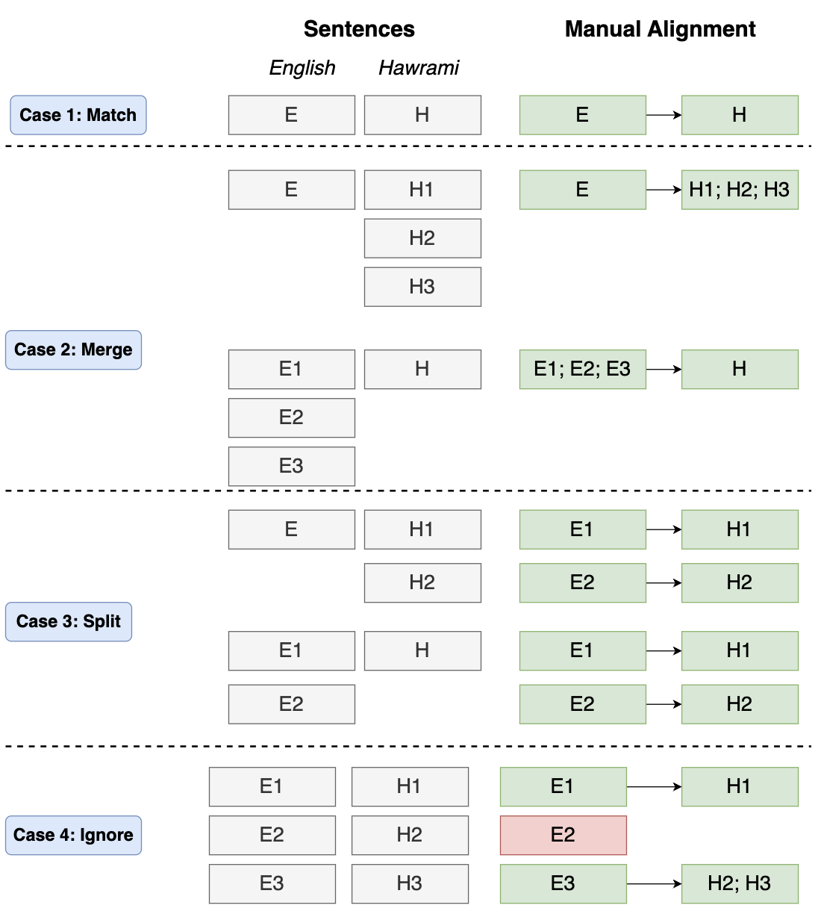

# Machine Translation for Middle Eastern Languages

This repository provides data and codes of the paper entitled [Literary Translations and Synthetic Data for Machine Translation of Low-resourced Middle Eastern Languages](https://sinaahmadi.github.io/docs/articles/ahmadi2025iwslt.pdf) accepted at the International Conference on Spoken Language Translation (IWSLT 2025) 2025. 

This project is a follow-up of [PARME](https://github.com/DOLMA-NLP/PARME) where over 36,000 translation pairs are provided for eight low-resourced languages in the Middle East: Luri Bakhtiari, Gilaki, Hawrami, Laki Kurdish, Mazandarani, Southern Kurdish, Talysh and Zazaki. The current project extends the resources with sentences from literary works.

## Alignment
Given translations of novels or storybooks in one of the target languages, our objective is to align each translated sentence with the original text, mostly in English. To do so, we try two approaches:

- **Automatically align**: automatically align translation with the original sentences using bitext mining and embeddings. This is prone to mismatches.
- **Manually align**: manually align sentences/phrases in those books with their original sentences in English. This has the highest quality but costly and time-consuming! The following schema shows the actions that a human aligner should make:

<p align="center" width="100%">

</p>

## Resources
### Datasets for reproducibility
In the paper, we report experiments using different alignment techniques, mostly relying in automatic alignment and LLMs, respectively referred to as `V` and `L`. However, by the time the paper was reviewed, we had manually aligned most of the automatically-aligned sentences! As such, there is no need specifically employ the datasets used in the paper, unless you are interested in the reproducibility of our experiment results.

The datasets with different shuffling seed keys used in the paper are provided in [datasets/reproducible_datasets.7z](datasets/reproducible_datasets.7z).

- **LLM-generated translation**: given sentences extracted from monolingual corpora, we translate them using LLMs.


## Licensing and Use

This dataset is derived from translated literary works, provided under agreement with the original publisher. It is in a format designed for research in language technology under the **Creative Commons Attribution 4.0 International (CC BY 4.0)** license. Please note that:

- The dataset **must not** be used to reconstruct the original literary works.
- You are free to share — copy and redistribute the material in any medium or format
- You are free to adapt — remix, transform, and build upon the material for any purpose, even commercially


## Cite this project

If you're using this project, please cite [this paper](https://sinaahmadi.github.io/docs/articles/ahmadi2025iwslt.pdf):

```
@inproceedings{ahmadi2025iwslt,
  title={Literary Translations and Synthetic Data for Machine Translation of Low-resourced {Middle Eastern} Languages},
  author={Ahmadi, Sina and Hameed, Razhan and Sennrich, Rico},
    booktitle = "Proceedings of the 63rd Annual Meeting of the Association for Computational Linguistics",
    year = "2025",
    address = "Vienna, Austria",
    publisher = "Association for Computational Linguistics"
}
```
